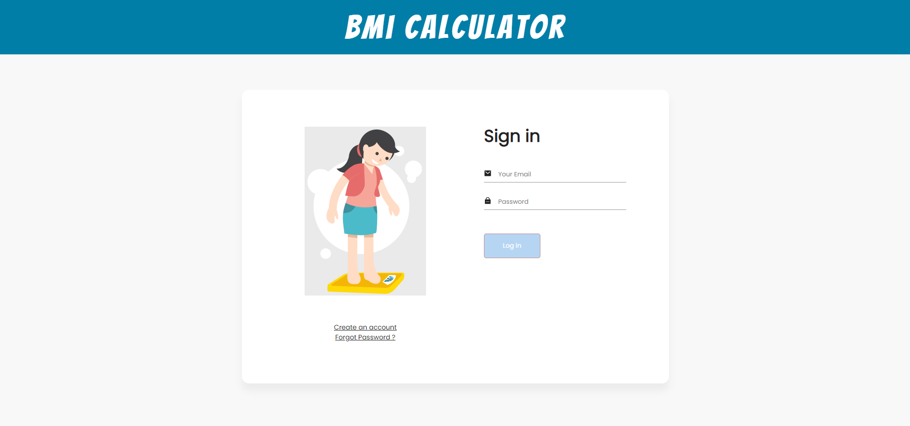

<div align="center" id="top"> 
  

  &#xa0;

  <a href="https://bmi-calculator-6e3e9.web.app/">Demo</a>
</div>

<h1 align="center">Bmi Calculator</h1>

<p align="center">
  

  

  

  

  <!--  -->

  <!--  -->

  <!--  -->
</p>

<!-- Status -->

<!-- <h4 align="center"> 
	🚧  Ulboard_mobile 🚀 Under construction...  🚧
</h4> 

<hr> -->

<p align="center">
  <a href="#dart-about">Description</a> &#xa0; | &#xa0; 
  <a href="#sparkles-features">Fonctionnalités</a> &#xa0; | &#xa0;
  <a href="#rocket-technologies">Technologies</a> &#xa0; | &#xa0;
  <a href="#white_check_mark-requirements">Conditions</a> &#xa0; | &#xa0;
  <a href="#checkered_flag-starting">Commencer</a> &#xa0; | &#xa0;
  <a href="#memo-license">Licence</a> &#xa0; | &#xa0;
  <a href="https://github.com/tkmmoise" target="_blank">Auteur</a>
</p>

<br>

## :dart: Description ##

Je cherchais toute idée pour pratiquer un peu react avec Firebase, et en écumant un peu sur internet, une idée m'est venue.

J'ai décidé de créer une application de calcul d'indice de masse corporelle (IMC), en anglais communément appelé BMI.

L'application est simple, premièrement on a une authentification, ensuite lorsque l'utilisateur est connecté, il y a une entree pour mettre le poids et une autre entree pour mettre la taille, l'application t'affiche ton indice de masse corporelle correspondant avec la date.

L'application conserve un historique des indices de masses corporelles calculées.

Vous pouvez voir la démo [ici](https://bmi-calculator-6e3e9.web.app/) 👈👈

## :sparkles: Fonctionnalités ##

:heavy_check_mark: Authentification par email et mot de passe;\
:heavy_check_mark: Calcul de l'IMC;\
:heavy_check_mark: Historique des IMCs calculées;\
:heavy_check_mark: Application responsive;

## :rocket: Technologies ##

The following tools were used in this project:

- [React](https://pt-br.reactjs.org/)
- [JavaScript](https://www.javascript.com/)
- [Firebase](https://console.firebase.google.com/)
- [Redux](https://redux.js.org/)

## :white_check_mark: Conditions ##

Avant de démarrer :checkered_flag:, vous devez avoir installé [Git](https://git-scm.com) et [Node](https://nodejs.org/en/). Vous devez créer un project sur [Firebase](https://console.firebase.google.com/) et configurer le fichier .env.

## :checkered_flag: Commencer ##

```bash
# Cloner ce projet
$ git clone https://github.com/tkmmoise/bmi-calculator

# Accéder
$ cd bmi-calculator

# Installer les dépendances
$ npm install

# Exécuter le projet
$ npx react-native start

```

## :memo: Licence ##

Ce projet est sous licence du MIT. Pour plus de détails, consultez le fichier [LICENSE](LICENSE.md).


Coder avec :heart: par <a href="https://github.com/tkmmoise" target="_blank">Moses</a>

&#xa0;

<a href="#top">Haut de la page</a>